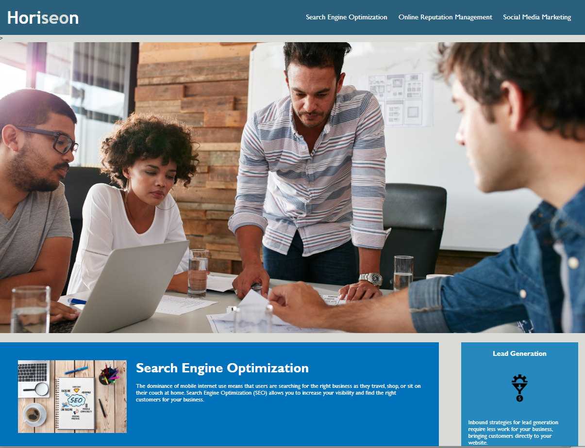

# horiseon landing page update
Updated code to follow accesssibility standards and optimize page for search engines.

## horiseon

A social media marketing agency, it is essential for horiseon's landing page to be accessible and optimized. In this project, I utilized semantic HTML elements, added alt attributes to all images, added a concise, descriptive title, and consolidated multiple classes for cleaner code.

## Links
Link to deployed URL: https://cjacktwil.github.io/horiseon/index.html  
Link to GitHub repository: https://github.com/cjacktwil/horiseon

## Screenshot

